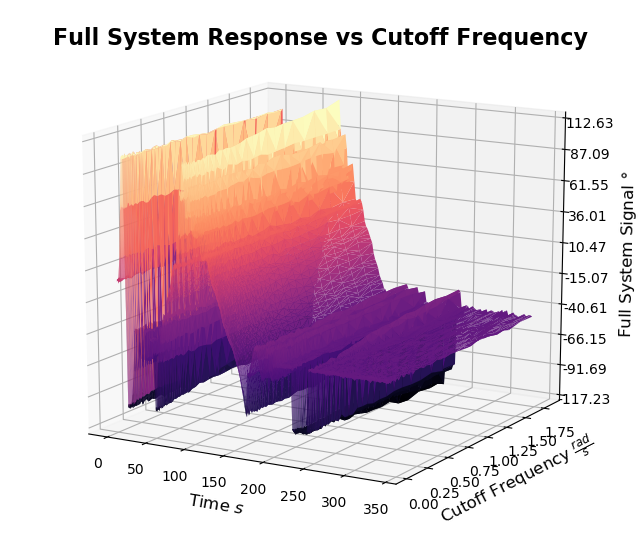
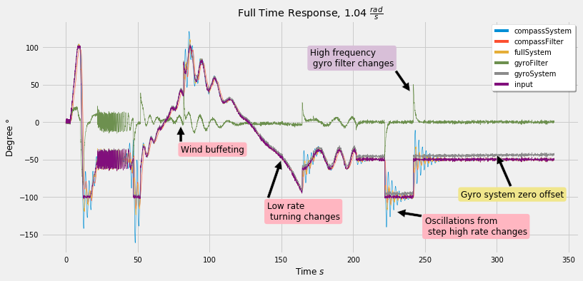

# Overview

I wanted to do a **Github-publishable** data science project to share my knowledge of Pandas and Python. I found the time to do it during an open-ended coursework, so this my first public data science playground! In this project, I made an integrated compass-gyro sensor system model, and after many simulations (4GB of CSV files), I wanted to find the optimal design parameters. I used Pandas for the Big-Data analysis, Matplotlib 3D to plot, and [MATLAB/Simulink](./data_generation_model/HeadingSystem.prj) (required) to model the system. See [this report](./report/report.pdf) on how the data was used, displayed and analysed.

Skills demonstrated in [this project Jupyter lab](./analytics/dataRawAnalytics.ipynb):
* Multi-dimensional data analytics and comprehension with Pandas MultiIndexes (3M+ data lines)
* Multi-dimensional data plotting with Pandas and Matplotlib 3D.
* Some programmatic cleanup for imperfect input file names.
* Data reshaping

The [report analysing all the data with all figures is here](./report/report.pdf). If you want to find out more about the modelling, I made a guide [here](./data_generation_model/README.md)

Some nice figures:

Have a great day and hope this is somewhat useful to you!
