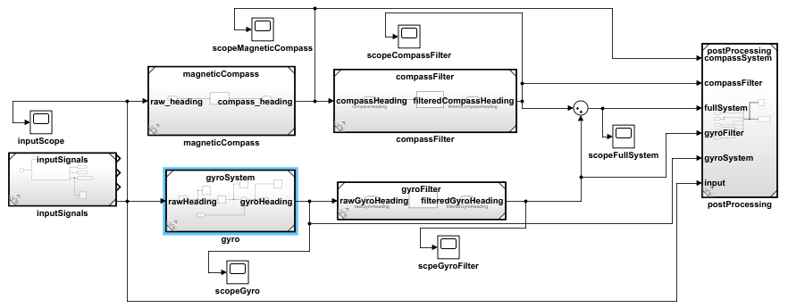

# Sensor Model

We perform sensor fusion for a aircraft directional sensor system using a compass and gyro. Integrating it and designing the optimal configuration is the desired aim of this project.

The Simulink model:

Overview:
* [Mathematical parameters](./brainstorm.ipynb)
* [Automated Simulation Variations](./errorCutoffFrequencyVariation.m)
* [Ideal analytical simulation](./signalPostProcessing.m)
* [Simulink model, designed only to run from ideal/iterative files above.](./fullSystem.slx)